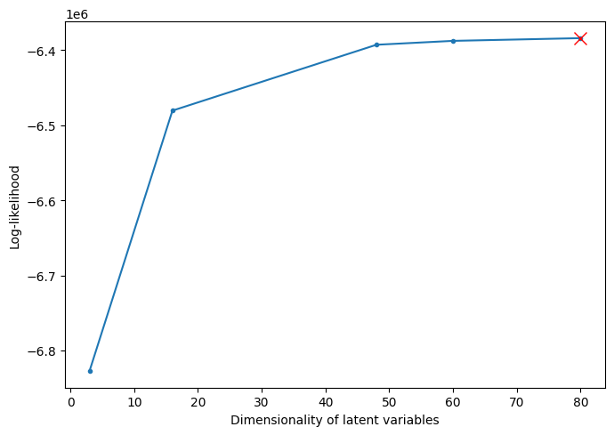

=======================================
Gaussian-Process Factor Analysis (GPFA)
=======================================

Gaussian-process factor analysis (GPFA) is a dimensionality reduction method [Yu2009]_ that extracts smooth, low-dimensional latent trajectories from noisy, high-dimensional time series data.
GPFA applies `factor analysis (FA) <https://scikit-learn.org/stable/modules/generated/sklearn.decomposition.FactorAnalysis.html>`_ to observed data to simultaneously reduce their dimensionality and smooth the resulting low-dimensional trajectories by fitting a `Gaussian process (GP) <https://scikit-learn.org/stable/modules/generated/sklearn.gaussian_process.kernels.Kernel.html#sklearn.gaussian_process.kernels.Kernel>`_ model to them.
See the below :ref:`notes` for its main differences to the popular PCA dimensionality redunction method.

The essential ingredients of the generative model underlying GPFA are *observations* :math:`\boldsymbol{X}` and *latent variables* :math:`\boldsymbol{Z}`.
For each high-dimensional time series in a dataset, the :math:`x_\textrm{dim}`-dimensional time series is split into :math:`T` time bins of size :math:`\delta t`, leading to the :math:`x_\textrm{dim} \times T`  matrix :math:`\boldsymbol{X}` that contains these data.
The observations in each time bin are assumed to be stochastically generated by a :math:`z_\textrm{dim}`-dimensional latent variable (:math:`z_\textrm{dim} < x_\textrm{dim}`) through some noisy linear mapping.
Across time, these latent variables are collected in the :math:`z_\textrm{dim} \times T` matrix :math:`\boldsymbol{Z}`.
A dataset usually contains a set of observations :math:`\boldsymbol{X}`'s that each have their associated latent variabes :math:`\boldsymbol{Z}`, and that all have the same observation and latent dimensions, :math:`x_\textrm{dim}` and :math:`z_\textrm{dim}`, but might differ in their number of time bins :math:`T`. 

.. _gpfa_prob_model:

GPFA's generative model is defined by the emission and the latent time-course models:

1. **Emission model**, :math:`p(\boldsymbol{X} | \boldsymbol{Z})`: GPFA's emission model assumes that, in each time bin :math:`t`, the observations :math:`\boldsymbol{x}_{:,t}` are generated independently through a stochastic linear mapping from the corresponding latent variables :math:`\boldsymbol{z}_{:,t}`,

   .. math:: \boldsymbol{x}_{:,t} | \boldsymbol{z}_{:,t} \sim \mathcal{N} \left( \boldsymbol{C} \boldsymbol{z}_{:,t} + \boldsymbol{d}, \boldsymbol{R} \right) ,

   where :math:`\boldsymbol{x}_{:,t}` and :math:`\boldsymbol{z}_{:,t}` are the :math:`t` th column (i.e., the :math:`t` th time bin) of :math:`\boldsymbol{X}` and :math:`\boldsymbol{Z}`, respectively, :math:`\mathcal{N}\left( \boldsymbol{\mu}, \boldsymbol{\Sigma}\right)` denotes the multivariate Gaussian with mean :math:`\boldsymbol{\mu}` and covariance :math:`\boldsymbol{\Sigma}`, and the loading matrix :math:`\boldsymbol{C}` (:math:`x_\textrm{dim} \times z_\textrm{dim}`), bias vector :math:`\boldsymbol{d}` (:math:`x_\textrm{dim}`), and diagonal (as in FA) emission covariance matrix :math:`\boldsymbol{R}` (:math:`x_\textrm{dim} \times x_\textrm{dim}`) are model parameters.

2. **Latent time-course model**, :math:`p(\boldsymbol{Z})`: GPFA assumes that the latent variables evolve in each latent dimension :math:`i` (or *factor*) independently according to a Gaussian process,

   .. math:: \boldsymbol{z}_{i,:} \sim \mathcal{GP} \left( \boldsymbol{0}, \boldsymbol{K} \right) ,

   where :math:`\boldsymbol{z}_{i,:}` is the :math:`i` th row (i.e., :math:`i` th latent dimension/factor) of :math:`\boldsymbol{Z}`, and :math:`\mathcal{GP} \left( \boldsymbol{0}, \boldsymbol{K} \right)` denotes a zero-mean Gaussian process with covariance kernel :math:`\boldsymbol{K}`. 

Overall, the model has emission model parameters :math:`\boldsymbol{C}`, :math:`\boldsymbol{d}`, and :math:`\boldsymbol{R}` and time-course model parameters that are the parameters of the chosen GP kernel :math:`\boldsymbol{K}`. When GPFA is fit to a set of observations, :math:`\boldsymbol{X}_1, \boldsymbol{X}_2, \dots`, GPFA adjusts these parameters and associated latent variables to best explain these observations.

.. _notes:

Notes
=====

GPFA differs from the popular `PCA <https://scikit-learn.org/stable/modules/generated/sklearn.decomposition.PCA.html>`_ in two significant ways:

1. It performs dimensionality reduction by factor analysis, which supports different residual variances in different data dimensions, whereas PCA assumed this residual variance to be the same across all dimensions.
2. PCA does not assume any temperal dependencies between different latent variables.
   GPFA, in contrast assumes latent trajecories to be smooth across time, and models this assumption by a Gaussian process.

.. _examples:

Examples
========

.. _example_1:

(i) Applying GPFA to synthetic data
-----------------------------------

This example illustrates the application of GPFA to data analysis by encompassing synthetic data generation, GPFA model fitting, and latent variable extraction. It emphasizes a step-by-step explanation of utilizing GPFA for data analysis, highlighting key functionalities of the library.

.. code-block:: python

   import numpy as np
   from gpfa import GPFA
   from sklearn.gaussian_process import GaussianProcessRegressor
   from sklearn.gaussian_process.kernels import ConstantKernel, RBF, WhiteKernel

   # Simulation parameters
   rng_seeds = [0, 42]
   z_dim = 2
   x_dim = 10
   tau_f = 0.6
   sigma_n = 0.001
   sigma_f = 1 - sigma_n
   bin_size = 0.05  # [s]
   num_obs = len(rng_seeds)
   T_per_obs = 400 
   kernel = ConstantKernel(sigma_f, constant_value_bounds='fixed') * RBF(length_scale=tau_f) + \
         ConstantKernel(sigma_n, constant_value_bounds='fixed') * WhiteKernel(noise_level=1, noise_level_bounds='fixed')

   tsdt = np.arange(0, T_per_obs) * bin_size

   np.random.seed(2)
   C = np.random.uniform(0, 2, (x_dim, z_dim))     # loading matrix
   sqrtR = np.random.uniform(0, 0.5, x_dim)

   # Generate latent and observation sequences in line with GPFA model
   X = []
   Z = []
   for n in range(num_obs):
      np.random.seed(rng_seeds[n])

      # Sample latent sequence according to GPFA latent time-course model
      gp_model = GaussianProcessRegressor(kernel=kernel, n_restarts_optimizer=20)
      
      z = gp_model.sample_y(tsdt[:, np.newaxis], n_samples=z_dim, random_state=rng_seeds[n]).T
      Z.append(z)
      # Sample observations according to GPFA emission model
      x = C @ z + np.random.normal(0, sqrtR, (T_per_obs, x_dim)).T
      X.append(x)

   # Fit GPFA to simulated observations
   gpfa = GPFA(bin_size=bin_size, z_dim=z_dim, em_tol=1e-4,)

   gpfa.fit(X)

   results = gpfa.predict(returned_data=['pZ_mu_orth', 'pZ_mu'])

   print(gpfa.variance_explained())

.. code-block:: console

   (0.9830394844469381, array([0.798201  , 0.18483849]))

Visualize the obtained latent trajectories against the true latents

.. code-block:: python

   import matplotlib.pyplot as plt

   true_Z = Z

   # Extract Z_orth and pZ_mu from results
   Z_orth = results[0]['pZ_mu_orth']
   pZ_mu = results[0]['pZ_mu']

   # Choose the latent dimension to compare
   latent_from_first_obs = 0
   latent_from_second_obs = 1

   # total time steps
   total_time_steps = len(Z_orth[latent_from_first_obs][0, :])

   # total time span in seconds
   total_time_span = total_time_steps * bin_size

   # number of seconds for x-ticks
   num_seconds = int(total_time_span)

   # Time array for the x-axis
   time_array = np.arange(0, total_time_span, bin_size)

   plt.figure(figsize=(13, 13))

   # Plot for the 1st latent dimension
   plt.subplot(2, 1, 1)

   # Plot true Z
   plt.plot(time_array, true_Z[latent_from_first_obs][0, :], label='True Z', linestyle='--', marker='o', color='blue', linewidth=3)

   # Plot inferred pZ_mu
   plt.plot(time_array, pZ_mu[latent_from_first_obs][0, :], label='Inferred Z', linestyle='--', marker='s', color='red', linewidth=3)

   # Plot inferred Z_orth
   plt.plot(time_array, Z_orth[latent_from_first_obs][0, :], label='Inferred Z_orth', linestyle='--', marker='x', color='green', linewidth=3)

   plt.ylabel('Latent Dimension 1', fontsize=20)
   plt.title(f'Comparison of Latent Dimension 1 from 1st Observations', fontsize=20)
   plt.xticks(np.arange(0, total_time_span + 1, 2), np.arange(0, num_seconds + 1, 2), fontsize=20)
   plt.yticks(fontsize=20)
   plt.legend(fontsize=25)

   # Plot for the 2nd latent dimension
   plt.subplot(2, 1, 2)

   # Plot true Z
   plt.plot(time_array, true_Z[latent_from_second_obs][0, :], label='True Z', linestyle='--', marker='o', color='blue', linewidth=3)

   # Plot inferred pZ_mu
   plt.plot(time_array, pZ_mu[latent_from_second_obs][0, :], label='Inferred Z', linestyle='--', marker='s', color='red', linewidth=3)

   # Plot inferred Z_orth
   plt.plot(time_array, Z_orth[latent_from_second_obs][0, :], label='Inferred Z_orth', linestyle='--', marker='x', color='green', linewidth=3)

   plt.xlabel('Time in Seconds', fontsize=25)
   plt.ylabel('Latent Dimension 1', fontsize=20)
   plt.title(f'Comparison of Latent Dimension 1 from 2nd Observations', fontsize=20)
   plt.xticks(np.arange(0, total_time_span + 1, 2), np.arange(0, num_seconds + 1, 2), fontsize=20)
   plt.yticks(fontsize=20)

   plt.tight_layout()
   plt.show()

.. image:: ../examples/example-2.png
   :width: 600
   :height: 600
   :alt: Results Image
   :align: center

.. _examples_2:

(ii) Applying GPFA to real neural Data
--------------------------------------
In the next example, we apply GPFA to real neural data obtained from DANDI archive [Even2022]_. The data originates from recordings of monkey J during the 3-ring task, with the following key details:

- The task was a center-out-and-back reaching task with 48 targets arranged in three concentric rings of 4, 8, and 12 cm radius, each with 16 targets.
- The monkey had to reach to a target that was randomly selected and presented on a screen, hold for 500 ms, and then return to the center.
- The delay period between the target onset and the go cue was uniformly distributed from 300 to 700 ms. In this example below, we used 500 ms for delay period.
- The neural activity in the dorsal premotor cortex (PMd) and primary motor cortex (M1) was recorded using a 96-electrode array.
- The data from four sessions (7722 trials) were combined for analysis, with only two sessions utilized for the current example.

.. note::
   
   This example is intended to showcase key functionalities of GPFA and does not aim to conduct an in-depth analysis of the provided data. For a comprehensive analysis, please refer to [Even2019]_.

Now, let's preprocess the spike data from two NWB files using the following code:

.. code-block:: python

   import pandas as pd
   import numpy as np
   import pynwb

   # Define functions for reading, calculating theta, filtering trials, and aligning spike times

   def read_nwb_file(file_path):
      """Read NWB file and return trials DataFrame."""
      nwbfile = pynwb.NWBHDF5IO(file_path, mode='r').read()
      return nwbfile.trials.to_dataframe()

   def calculate_theta_and_filter(trial_df):
      """Calculate theta and filter trials based on delay time."""
      trial_df = trial_df[trial_df['is_successful'] != 0].copy()
      trial_df['tuple_col'] = trial_df['target_pos'].apply(tuple)
      trial_df['theta'] = (np.rad2deg(np.arctan2(trial_df['tuple_col'].apply(lambda x: x[0]),
                                                   trial_df['tuple_col'].apply(lambda x: x[1])))
                           ).round(1) % 360

      condition = trial_df['go_cue_time'] - trial_df['target_shown_time'] < 0.005
      rows_to_drop = trial_df.index[condition]
      trial_df.drop(rows_to_drop, inplace=True)
      trial_df.reset_index(drop=True, inplace=True)
      return trial_df

   def align_spike_times(nwbfile, trial_df):
      """Align spike times to trial start time."""
      for index, row in trial_df.iterrows():
         trial_spike_times = []

         for unit in range(len(nwbfile.units)):
               unit_spike_times = nwbfile.units["spike_times"][unit]
               spikes_in_trial = unit_spike_times[
                  (row['start_time'] <= unit_spike_times) & (unit_spike_times <= row['stop_time'])
               ]
               aligned_spikes = spikes_in_trial - row['start_time']
               trial_spike_times.append(aligned_spikes)

         trial_df.at[index, 'timeseries'] = trial_spike_times
      return trial_df

   def preprocess_spike_data(nwbfile1_path, nwbfile2_path):
      """Preprocess spike data from two NWB files."""
      nwbfile1 = pynwb.NWBHDF5IO(nwbfile1_path, mode='r').read()
      nwbfile2 = pynwb.NWBHDF5IO(nwbfile2_path, mode='r').read()

      trial_df1 = calculate_theta_and_filter(read_nwb_file(nwbfile1_path))
      trial_df2 = calculate_theta_and_filter(read_nwb_file(nwbfile2_path))

      trial_df1 = align_spike_times(nwbfile1, trial_df1)
      trial_df2 = align_spike_times(nwbfile2, trial_df2)

      # Concatenate DataFrames
      trial_df = pd.concat([trial_df1, trial_df2], ignore_index=True)

      # Get the reaching angle with the least num of trials and set it to be
      # the num of trial for all reaching angles
      min_theta_counts = trial_df['theta'].value_counts().nsmallest(1).values[0]
      trial_df = trial_df.groupby('theta').head(min_theta_counts)

      # Drop unnecessary columns
      trial_df.drop(
         ['tuple_col', 'version_id', 'target_size', 'barrier_points',
            'fail_time', 'reach_time', 'target_pos'], axis=1, inplace=True)

      # Sort the DataFrame based on the updated 'theta' values
      trial_df.sort_values(by='theta', inplace=True)

      # Reset the index after sorting
      trial_df.reset_index(drop=True, inplace=True)

      return trial_df

   nwbfile1_path = 'sub-JenkinsC_ses-20160127T110630_behavior+ecephys.nwb'
   nwbfile2_path = 'sub-JenkinsC_ses-20160128T160749_behavior+ecephys.nwb'
   trial_df = preprocess_spike_data(nwbfile1_path, nwbfile2_path)

   # let's look at the total number of trials
   trial_df.shape
   
.. code-block:: console
   
   (4336, 11)

Now, let's organize the spike train data from the trial DataFrame. This involves calculating the number of unique reach angles, the number of trials per reach angle, and the total number of neurons. We'll initialize an empty array to store spike trains for each reach and trial, and then populate this array by iterating through the trial DataFrame. The following code accomplishes this:

.. code-block:: python

   n_reaches = len(trial_df['theta'].unique())  # Number of unique reach angles
   n_trials_per_reach = len(trial_df[trial_df['theta'] == 0.0])  # Number of trials per reach angle
   n_neurons = len(trial_df['timeseries'].iloc[0])  # Number of neurons

   # Initialize an empty array to store spike trains for each reach and trial
   spiketrains = np.empty(shape=(n_reaches, n_trials_per_reach), dtype=object)

   # Iterate through the trial dataframe and populate the spiketrains array
   for i_row, row in trial_df.iterrows():
      i_reach = i_row % n_reaches  # Calculate the reach index
      i_trial = i_row % n_trials_per_reach  # Calculate the trial index within each reach

      spiketrains[i_reach, i_trial] = row['timeseries']
   
   print(f'Number of reaching angles: {n_reaches}')
   print(f'Number of trials per reaching angle: {n_trials_per_reach}')
   print(f'Number of neurons: {n_neurons}')

.. code-block:: console

   Number of reaching angles: 16
   Number of trials per reaching angle: 271
   Number of neurons: 192

Next, we'll further preprocess the training data for spike train analysis. Here, we set the number of trials for training (`n_train_trials`) and calculate the remaining trials for testing. We set the bin size for spike train analysis as 0.05 throughout this example.

.. code-block:: python

   from gpfa.preprocessing import EventTimesToCounts
   from sklearn.preprocessing import FunctionTransformer

   n_train_trials = 217  # Number of trials for training (~80 % of total trials)
   n_test_trials = n_trials_per_reach - n_train_trials  # Remaining trials for testing
   train_data = spiketrains[:, :n_train_trials]  # Extract training data

   bin_size = 0.05  # Set the bin size for spike train analysis

   # Convert event times to spike counts and apply square root transformation
   binned_spiketrains = [
      EventTimesToCounts(bin_size=bin_size, extrapolate_last_bin=True).transform(x_i) for x_i in train_data.reshape((-1,))
   ]
   sqrt_spiketrains = [FunctionTransformer(np.sqrt).transform(x_i) for x_i in binned_spiketrains]

.. code-block:: python

   # Drop any inactive neurons
   row_to_drop = []

   for i, x in enumerate(np.hstack(sqrt_spiketrains)):
      if np.all(x == 0):
         row_to_drop.append(i)

   non_zero_spiketrains = [np.delete(train, row_to_drop, axis=0) for train in sqrt_spiketrains]
   active_neurons = n_neurons - len(row_to_drop)

   print(f'Number of active neurons: {active_neurons}')

.. code-block:: console

   Number of active neurons: 192

.. code-block:: python

   # verify that the rank of the data is the same as the num of active neurons
   X_all = np.hstack(non_zero_spiketrains)
   rank = np.linalg.matrix_rank(np.cov(X_all))

   print(f'Rank of training data: {rank}')

.. code-block:: console

   Rank of training data: 192

Great! Now that we have preprocessed the spike train data, we can proceed to initialize and fit the GPFA model. We will initialize it to 48 latents because the data has 3 rings with 16 targets each.

.. code-block:: python

   from gpfa import GPFA

   # Initialize GPFA
   n_latents = 48  # number of latent states
   gpfa = GPFA(bin_size=bin_size, z_dim=n_latents)

   # Fit GPFA
   gpfa.fit(non_zero_spiketrains, use_cut_trials=True)

.. code-block:: console

   Initializing parameters using factor analysis...

   Fitting GPFA model...

Once the training is complete, you can assess the model performance by examining variance explained.

.. code-block:: python

   # Assess the variance explained on the training data set
   variance_explained_train = gpfa.variance_explained()
   print(f"Variance Explained on Training Set: \n{variance_explained_train}")

.. code-block:: console

   Variance Explained on Training Set:
   (0.3970230153314942,
   array([0.17165833, 0.05598068, 0.02217088, 0.01764129, 0.01445148,
          0.01045345, 0.00895452, 0.00731255, 0.00684016, 0.00642401,
          0.0056885 , 0.00494399, 0.00479669, 0.0044759 , 0.00420214,
          0.00325435, 0.0032261 , 0.00296593, 0.00287115, 0.00256505,
          0.00239621, 0.00218309, 0.00205919, 0.00197201, 0.00196691,
          0.00179161, 0.00163562, 0.00166712, 0.00151755, 0.00148905,
          0.00140823, 0.00138457, 0.00131166, 0.00124003, 0.00116197,
          0.0011656 , 0.00108043, 0.00107707, 0.00103796, 0.00096812,
          0.00091908, 0.00089293, 0.00081414, 0.00080256, 0.00068832,
          0.00062171, 0.00049797, 0.00039513]))

Let's get the latent trajectories (both orthogonal and standard) on the training set as follows.

.. code-block:: python

   outs, ll = gpfa.predict(returned_data=['pZ_mu', 'pZ_mu_orth'])
   latent_trajectories_train, latent_trajectories_orth_train = outs['pZ_mu'].reshape((n_reaches, n_train_trials)),
            outs['pZ_mu_orth'].reshape((n_reaches, n_train_trials))

Let's get test data from the spiketrains, converts event times to spike counts, applies a square root transformation, removes inactive neurons, and predicts latent trajectories on the test set using the trained GPFA model.

.. code-block:: python

   # Extract test data from the remaining trials
   test_data = spiketrains[:, n_train_trials:]

   # Convert test spike train data to binned format and apply square root transformation
   binned_spiketrains_test = [EventTimesToCounts(bin_size=bin_size, extrapolate_last_bin=True).transform(x_i) for x_i in test_data.reshape((-1,))]
   sqrt_spiketrains_test = [FunctionTransformer(np.sqrt).transform(x_i) for x_i in binned_spiketrains_test]

   # Remove a specific row from each test dataset
   non_zero_spiketrains_test = [np.delete(test, row_to_drop, axis=0) for test in sqrt_spiketrains_test]

   # Predict latent trajectories on the preprocessed test data
   outs, ll = gpfa.predict(non_zero_spiketrains_test, returned_data=['pZ_mu', 'pZ_mu_orth'])

   # Reshape the predicted latent trajectories for further analysis
   latent_trajectories_test, latent_trajectories_orth_test = outs['pZ_mu'].reshape((n_reaches, n_test_trials)), \
               outs['pZ_mu_orth'].reshape((n_reaches, n_test_trials))

Next, we'll assess the variance explained on the test set.

.. code-block:: python

   # Assess the variance explained on the test data set
   variance_explained_test = gpfa.variance_explained()
   print(f"Variance Explained on Test Set: \n{variance_explained_test}")

.. code-block:: console

   Variance Explained on Test Set:
   (0.4032239611036961,
   array([0.1779022 , 0.056605  , 0.02302932, 0.017137  , 0.01474933,
          0.01055342, 0.00932276, 0.00708769, 0.00692276, 0.00623751,
          0.00544786, 0.00476861, 0.00470396, 0.00448433, 0.00397946,
          0.00326405, 0.00314801, 0.00299277, 0.00278887, 0.00248188,
          0.00234142, 0.00215914, 0.00200611, 0.00199166, 0.00192332,
          0.0017876 , 0.00171319, 0.00170453, 0.00148304, 0.00142499,
          0.00142261, 0.00134464, 0.00126279, 0.00119912, 0.00110158,
          0.00114807, 0.0010453 , 0.00106653, 0.00101568, 0.00095345,
          0.00090478, 0.00086615, 0.00083584, 0.00080269, 0.00067107,
          0.00058438, 0.00048245, 0.00037507]))
         
Visualize the orthogonal latent trajectories on the test data set. Here we are plotting the mean trajectory for each reach direction. The blue dots are the average movement onset reach direction.

.. code-block:: python

   import itertools
   from matplotlib.animation import FuncAnimation
   import matplotlib.pyplot as plt
   from IPython.display import HTML

   movement_onset = 0.5 # s after data starts
   movement_offset = .1 # s before data ends
   def plot_reach_trajectories(
         trajectories, animate=False, elev_amount=30, view_angle=25.5,
         n_reaches=n_reaches, n_test_trials=n_test_trials, movement_onset=movement_onset, bin_size=bin_size):
      
      reaches = [0.0, 22.5, 45.0, 67.5, 90.0, 112.5, 135.0, 157.5, 180.0, 202.5, 225.0, 247.5, 270.0, 292.5, 315.0, 337.5]
      
      # Get mean latent trajectories for each reach direction
      min_time_bins = np.min(
         [trajectories.reshape((-1,))[i_trial].shape[1] for i_trial in range(n_reaches*n_test_trials)]
         )

      mean_trajectories = np.zeros((n_reaches, 3, min_time_bins))
      for i_reach in range(n_reaches):
         for i_trial in range(0, n_test_trials - 1):
            mean_trajectories[i_reach] +=  trajectories[i_reach, i_trial][:3, :min_time_bins]
      mean_trajectories /= n_test_trials

      onset_bin = int(movement_onset/bin_size)

      fig = plt.figure(figsize=(12, 10))
      ax = fig.add_subplot(1, 1, 1, projection='3d')
      c_vec = itertools.cycle(plt.rcParams['axes.prop_cycle'].by_key()['color'])
      lines = {}
      # indiv_trial = {}
      onset_points = {}

      for i_reach in range(n_reaches):
         color = next(c_vec)

         lines[i_reach], = ax.plot([], [], [], linewidth=2, color=color, alpha=.8, label=f'{reaches[i_reach]} degrees reach')
         onset_points[i_reach], = ax.plot([], [], [], 'ob')
         ax.set(xlim=[-8.1, -0.8], ylim=[-4.1, 2.1], zlim=[-5.1, 0.1],
               xlabel='Latent dim 1', ylabel='Latent dim 2', zlabel='Latent dim 3')
      plt.legend()
      def drawframe(n):
         n = min(n, min_time_bins)
         for i_reach in range(n_reaches):

            lines[i_reach].set_data(mean_trajectories[i_reach][0, :n],
                           mean_trajectories[i_reach][1, :n])
            lines[i_reach].set_3d_properties(mean_trajectories[i_reach][2, :n])
            if n >= onset_bin:
               onset_points[i_reach].set_data([mean_trajectories[i_reach][0, onset_bin]],
                  [mean_trajectories[i_reach][1, onset_bin]])
               onset_points[i_reach].set_3d_properties([mean_trajectories[i_reach][2, onset_bin]])

         return lines[0],

      ax.view_init(elev=elev_amount, azim=view_angle)

      if animate:
         anim = FuncAnimation(fig, drawframe, frames=50, interval=100, blit=True)
         anim.save('reach_trajectories_48.gif', writer='pillow')
         plt.close()
         return HTML(anim.to_jshtml())

      else:
         drawframe(50)

   plot_reach_trajectories(latent_trajectories_orth_test, animate=True, n_test_trials=n_test_trials)

Click on the animation to zoom in.

.. figure:: /_static/reach_trajectories_48.gif
   :alt: Reach trajectories animation
   :width: 1200px
   :height: 600px
   :align: center

Great! Next, we will demonstrate how to utilize GPFA with multiple parameters.
In this example, we are using a composite kernel for the Gaussian Process, incorporating two parameters: `length_scale` and `noise_level`. The GPFA model will be trained using this customized kernel, showcasing the flexibility of GPFA in handling multiple parameters for enhanced modeling capabilities.

.. code-block:: python

   from sklearn.gaussian_process.kernels import ConstantKernel, RBF, WhiteKernel

   # Define GPFA with a composite kernel having two parameters: length_scale and noise_level
   multi_params_kernel = ConstantKernel(1 - 0.001, constant_value_bounds='fixed') * RBF(length_scale=0.1) + \
                        ConstantKernel(0.001, constant_value_bounds='fixed') * WhiteKernel(noise_level=1)

   gpfa_with_multi_params_kernel = GPFA(bin_size=bin_size, z_dim=n_latents, gp_kernel=multi_params_kernel)

   # Fit GPFA with the specified kernel
   gpfa_with_multi_params_kernel.fit(non_zero_spiketrains, use_cut_trials=True)

.. code-block:: console

   Initializing parameters using factor analysis...

   Fitting GPFA model...

Let's predict latent trajectories on the preprocessed test data

.. code-block:: python
   
   outs, ll = gpfa_with_multi_params_kernel.predict(non_zero_spiketrains_test, returned_data=['pZ_mu', 'pZ_mu_orth'])

   # Reshape the predicted latent trajectories for further analysis
   latent_trajectories_test, latent_trajectories_orth_test = outs['pZ_mu'].reshape((n_reaches, n_test_trials)), \
            outs['pZ_mu_orth'].reshape((n_reaches, n_test_trials))

Let's assess the varince explained.

.. code-block:: python

   # Assess the variance explained on the test data set
   variance_explained_test = gpfa_with_multi_params_kernel.variance_explained()
   print(f"Variance Explained on Test Set: \n{variance_explained_test}")

.. code-block:: console

   Variance Explained on Test Set:
   (0.39598750814685524,
   array([0.17805107, 0.05657487, 0.02298279, 0.01688505, 0.01460986,
          0.01036282, 0.00928363, 0.0069379 , 0.0067379 , 0.0062202 ,
          0.00543185, 0.00472988, 0.00447406, 0.00441091, 0.00390778,
          0.0031007 , 0.00300151, 0.00277642, 0.00274983, 0.00231781,
          0.00209841, 0.00191162, 0.00181487, 0.00168421, 0.00154912,
          0.00162265, 0.00156154, 0.00147708, 0.00125867, 0.0012201 ,
          0.00118523, 0.00110788, 0.00104621, 0.00095257, 0.0009578 ,
          0.00090849, 0.0008269 , 0.00084659, 0.00080986, 0.00078851,
          0.00077354, 0.00073286, 0.00064708, 0.00061418, 0.0005955 ,
          0.00056164, 0.00045899, 0.00042856]))

And as with the previous example, we can visualize the latent trajectories.

.. figure:: /_static/reach_trajectories_48_mult_params.gif
   :alt: Reach trajectories animation
   :width: 1200px
   :height: 600px
   :align: center

Next, we will illustrate the utilization of GPFA with a sequence of kernels, offering users the flexibility to initialize each latent variabes with distinct parameters. For the purposes of this demonstration, we will focus on employing three distinct kernels and corresponding latent dimensions.

.. code-block:: python

   # Train GPFA using a sequence of kernals that have a different initialization of `length_scale`
   seq_kernel = [ConstantKernel(
                  1-0.001, constant_value_bounds='fixed'
                  ) * RBF(length_scale=0.1) + ConstantKernel(
                     0.001, constant_value_bounds='fixed'
                     ) * WhiteKernel(
                           noise_level=1, noise_level_bounds='fixed'
                           ),
                  ConstantKernel(
                  1-0.001, constant_value_bounds='fixed'
                  ) * RBF(length_scale=0.05) + ConstantKernel(
                     0.001, constant_value_bounds='fixed'
                     ) * WhiteKernel(
                           noise_level=1, noise_level_bounds='fixed'
                              ),
                  ConstantKernel(
                  1-0.001, constant_value_bounds='fixed'
                  ) * RBF(length_scale=0.15) + ConstantKernel(
                     0.001, constant_value_bounds='fixed'
                     ) * WhiteKernel(
                           noise_level=1, noise_level_bounds='fixed'
                              )            
               ]
   n_latents = 3
   gpfa_with_seq_kernel = GPFA(
      bin_size=bin_size,
      z_dim=n_latents,
      gp_kernel=seq_kernel
      )
   gpfa_with_seq_kernel.fit(non_zero_spiketrains, use_cut_trials=True)

.. code-block:: console

   Initializing parameters using factor analysis...

   Fitting GPFA model...

.. code-block:: python

   # Assess the variance explained on the test data set
   variance_explained_test = gpfa_with_seq_kernel.variance_explained()
   print(f"Variance Explained on Test Set: \n{variance_explained_test}")

.. code-block:: console

   (0.2506544239196746, array([0.17618384, 0.05458081, 0.01988977]))

Finally, we aim to estimate the dimensionality of the underlying space. This involves fitting GPFA models with various assumed latent dimensionality, such as 3 latents for 3 rings, 16 for 16 reach directions, 48 for the total number of targets, and 60 and 80 as an arbitrary value. The subsequent step is to compare the log-likelihood across these models using cross-validation.

.. code-block:: python

   # Get the all dataset
   binned_spiketrains_cv = [EventTimesToCounts(bin_size=bin_size, extrapolate_last_bin=True).transform(x_i) for x_i in spiketrains.reshape((-1,))]
   sqrt_spiketrains_cv = [FunctionTransformer(np.sqrt).transform(x_i) for x_i in binned_spiketrains_cv]

   non_zero_spiketrains_cv = [np.delete(test, row_to_drop, axis=0) for test in sqrt_spiketrains_cv]

.. code-block:: python

   from sklearn.model_selection import cross_val_score

   n_latents = [3, 16, 48, 60, 80]
   log_likelihoods = []

   # Define the additional parameter
   fit_params = {'use_cut_trials': True}

   # Iterating over different latent dimensions
   for n_latent in n_latents:
      gpfa_cv = GPFA(bin_size=bin_size, z_dim=n_latent)
      
      # Cross-validation to assess log-likelihood
      cv_log_likelihoods = cross_val_score(gpfa_cv, non_zero_spiketrains_cv, cv=3, n_jobs=-1, verbose=True, fit_params=fit_params)
      
      # Append mean log-likelihood to the list
      log_likelihoods.append(np.mean(cv_log_likelihoods))

Let’s plot the obtained log-likeliyhood as a function of the dimensionality.

.. code-block::

   fig = plt.figure(figsize=(7, 5))
   plt.xlabel('Dimensionality of latent variables')
   plt.ylabel('Log-likelihood')
   plt.plot(n_latents, log_likelihoods, 'o-')
   plt.plot(n_latents[np.argmax(log_likelihoods)], np.max(log_likelihoods), 'x', markersize=10, color='r')
   plt.tight_layout()
   plt.show()

This outcome implies that among the tested latent dimensionalities, the GPFA model with 80 latent states provides the most favorable explanation for the observed spiking activity patterns. In essence, the configuration with 80 latent dimensions is deemed the most likely to have generated the recorded neural data.

Original code
-------------
The code was adjusted and extended from the `Elephant ephys analysis toolkit <http://neuralensemble.org/elephant/>`_ which is a direct Python translation of `Byron Yu's MATLAB implementation <https://users.ece.cmu.edu/~byronyu/software.shtml>`_.

References
----------
.. [Yu2009] `Yu, Byron M and Cunningham, John P and Santhanam, Gopal and
    Ryu, Stephen and Shenoy, Krishna V and Sahani, Maneesh
    "Gaussian-process factor analysis for low-dimensional single-trial
    analysis of neural population activity"
    In Journal of Neurophysiology, Vol. 102, Issue 1. pp. 614-635.
    <https://doi.org/10.1152/jn.90941.2008>`_

.. [Even2022] `Even-Chen, Nir and Sheffer, Blue and Vyas, Saurabh and Ryu, Stephen
    and Shenoy, Krishna (2022)
    "Structure and variability of delay activity in premotor cortex"
    (Version 0.220124.2156) [Data set]. DANDI archive.
    <https://doi.org/10.48324/dandi.000121/0.220124.2156>`_

.. [Even2019] `Even-Chen, Nir and Sheffer, Blue and Vyas, Saurabh and Ryu, Stephen
    and Shenoy, Krishna (2022)
    "Structure and variability of delay activity in premotor cortex"
    PLoS computational biology, 15(2), e1006808. <https://doi.org/10.1371/journal.pcbi.1006808>`_

.. toctree::
    :maxdepth: 2
    :hidden:

    gpfa_class
    preprocessing_class
    installation
    contribute
    acknowledgments
    authors
    citation
